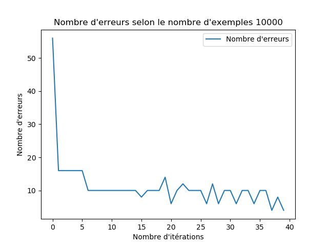
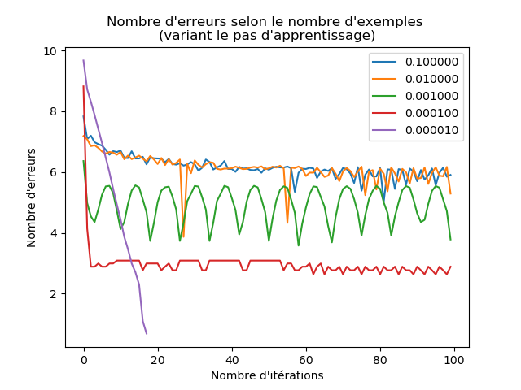

# SIMON HEBAN
## M1 WeDSci

### Installation

Vérifiez que python et matplotlib sont installés

    mkdir build
    cd build
    cmake ..
    ./TP4

### Question 3.1

Plus le nombre itération est grand plus le nombre d'erreurs est faible

### Question 3.2

On remarque sur ces deux graphes que plus un jeu de données et important, plus le nombre d'itérations avant de ne plus faire d'erreurs sera important

> Plus d'erreurs à partir de la 37ème itération

> Plus d'erreurs à partir de la 39ème itération

## Question 3.3

Le pas influe sur le nombre d'itérations nécessaire pour ne plus avoir d'erreurs, un pas d'apprentissage se rapprochant de un fera une descente plus radical, elle convient donc un petit nombre d'exemples.
Si on utilise un pas d'apprentissage petit, la descente est moins brutale, et on risque moins oublié des valeurs minimales.
C'est pour cela que l'on utilisera un pas de plus en plus petit au fur et à mesure que notre jeu de données grandit (e.g 5 millions)

On remarque que si le nombre d'exemples est petit et que le pas d'apprentissage est petit aussi, alors le nombre d'erreurs est grand.

> On remarque ici que la courbe violette (plus petit pas d'apprentissage) provoque beaucoup d'erreurs.

Tandis que si l'on a un nombre d'exemples élevés (e.g 1 millions), et un pas d'apprentissage petit, on minimise alors le nombre d'erreurs.

> On remarque à contrario, que la courbe violette va minimiser le nombre d'erreurs, elle va d'ailleurs ne plus faire d'erreurs à partir de la ~19 itérations