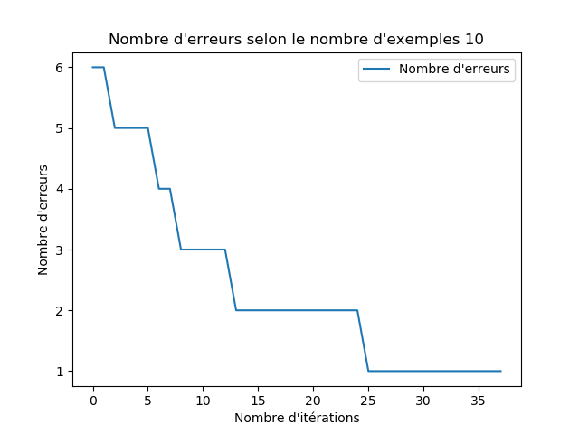

# SIMON HEBAN

## M1 WeDSci

# Installation

Vérifiez que python et matplotlib sont installés

    mkdir build
    cd build
    cmake ..
    ./TP4

# QUESTION 3.1

### *Analyse de données*


> On constate ici que le problème est linéairement séparable, on pourra prédire avec précision

### *Entrainement*

Plus le nombre itération est grand plus le nombre d'erreurs est faible


# QUESTION 3.2

On remarque sur ces deux graphes que plus un jeu de données et important, plus le nombre d'itérations avant de ne plus
faire d'erreurs sera important


> Plus d'erreurs à partir de la 37ème itération


> Plus d'erreurs à partir de la 39ème itération

# QUESTION 3.3

Le pas influe sur le nombre d'itérations nécessaire pour ne plus avoir d'erreurs, un pas d'apprentissage se rapprochant
de un fera une descente plus radical, elle convient donc un petit nombre d'exemples. Si on utilise un pas
d'apprentissage petit, la descente est moins brutale, et on risque moins oublié des valeurs minimales. C'est pour cela
que l'on utilisera un pas de plus en plus petit au fur et à mesure que notre jeu de données grandit (e.g 5 millions)

| pas d'apprentissage | jeu de données          | Arrêt des itérations|
| ------------------- | ----------------------- |---------------------|
|   0.01              |      10                | 9 |
| 0.01                  | 100 | 2 |
| 0.01 | 1000 | 3 |
| 0.01 | 10000 | +100 |

On remarque ici que le pas d'apprentissage est trop grossier pour le jeu de données 10000, il faut donc l'augmenter :

| pas d'apprentissage | jeu de données          | Arrêt des itérations|
| ------------------- | ----------------------- |---------------------|
| 0.001                | 10000                 | +100                |
| 0.0001               | 10000                  | +100 |
| 0.00001               | 10000                 | 17.5|


On remarque que si le nombre d'exemples est petit et que le pas d'apprentissage est petit aussi, alors le nombre
d'erreurs est grand.

> On remarque ici que la courbe violette (plus petit pas d'apprentissage) provoque beaucoup d'erreurs.


Tandis que si l'on a un nombre d'exemples élevés (e.g 1 millions), et un pas d'apprentissage petit, on minimise alors le
nombre d'erreurs.

> On remarque à contrario, que la courbe violette va minimiser le nombre d'erreurs, elle va d'ailleurs ne plus faire d'erreurs à partir de la ~19 itérations

# QUESTION 3.4

On remplace la génération de données voir le fichier `lib/Helper.cpp`

```cpp
//res.emplace_back(std::make_pair(std::make_pair(x1,x2), ((x1+x2-1 > 0) ? 1 : -1)));
res.emplace_back(std::make_pair(std::make_pair(x1, x2), ((x1+x2-1 > 0 && x2 > 0.5) ? 1 : -1)));
```

Ce qui donne cette représentation :

### *Analyse de données*


On constate tout de suite que l'on ne pourra pas avoir des réponses exactes, en effet, le perceptron est un classifier
linéaire, il nous sera imossible de bien séparer les rouges des bleues, on fera toujours des erreurs dans les grands
jeux de données, en effet si on a un petit jeu de données il est possible que certains points rouges ne soit pas générer
dans la zone non prédictible.

### *Entrainement*


> On remarque ici un nombre bas d'erreurs dû à un petit jeu de données (50 exemples)


> Ici les erreurs sont très fréquentes, car impossible de prédire une partie des points rouges, car le jeu de données est trop grand, donc on se retrouve avec le schéma du dessus et il est donc impossible de tracer une droite de façon à séparer les deux groupes.

# Partie 3.5

## Test de la première version

Premier test sur le perceptron de la partie 3.1:

```
Echantillon pour l'apprentissage : 300
Echantillon pour le test : 700
Pas d'apprentissage: 0.01
nombre d'itération: 100
```

On remarque que le perceptron produit environ 1% d'erreurs

```
Le perceptron à fait 10 erreur(s) (1.42857%)
Le perceptron à fait 10 erreur(s) (1.42857%)
Le perceptron à fait 6 erreur(s) (0.857143%)
Le perceptron à fait 4 erreur(s) (0.571429%)
Le perceptron à fait 5 erreur(s) (0.714286%)
Le perceptron à fait 9 erreur(s) (1.28571%)
Le perceptron à fait 3 erreur(s) (0.428571%)
Le perceptron à fait 11 erreur(s) (1.57143%)
Le perceptron à fait 5 erreur(s) (0.714286%)
Le perceptron à fait 10 erreur(s) (1.42857%)
Le perceptron à fait 8 erreur(s) (1.14286%)
Le perceptron à fait 8 erreur(s) (1.14286%)
Le perceptron à fait 4 erreur(s) (0.571429%)
Le perceptron à fait 3 erreur(s) (0.428571%)
Le perceptron à fait 9 erreur(s) (1.28571%)
Le perceptron à fait 7 erreur(s) (1%)
Le perceptron à fait 5 erreur(s) (0.714286%)
Le perceptron à fait 10 erreur(s) (1.42857%)
Le perceptron à fait 4 erreur(s) (0.571429%)
Le perceptron à fait 8 erreur(s) (1.14286%)
moyenne des erreurs = 0.992857%
```

En augmentant progressivement l'échantillon d'apprentissage la moyenne des erreurs diminue

```
    Moyenne d'erreurs pour un échantillon de 3000 en apprentissage : 0.0142857%
    Moyenne d'erreurs pour un échantillon de 30000 en apprentissage: 0%
```

Ceci s'explique assez simplement, en effet si l'on ne génère pas assez de points on ne remplit pas assez les deux
groupes, c'est-à-dire que si l'on ne génère pas assez de données d'entrainement on peut se retrouver dans le cas ou tous
les points rouges sont en bas et tous les points bleus en haut, ce qui fait que notre droite séparatrice serait
horizontale, ce qui ne convient pas à notre modèle ci !

## Deuxième test sur le perceptron de la partie 3.4 :

```
Echantillon pour l'apprentissage : 300
Echantillon pour le test : 700
Pas d'apprentissage: 0.01
nombre d'itération: 100
```

| Échantillon apprentissage | Moyenne des erreurs |
| ------------------------- | -------------------:|
| 300 | 8.44286% |
| 3000 | 7.25% |
| 30000 | 9.59286% |
| 300000 | 9.93571% |
| 3000000 | 7.32857% |

Ici on remarque que l'on ne pourra jamais atteindre zéro erreur, car le problème n'est pas linéairement séparable, de ce
fait, nous aurons toujours une tendance à faire des erreurs, ici on peut prétendre à faire ~7.38% d'erreurs, ce sont les points qui
ne pourront être séparés par la droite.