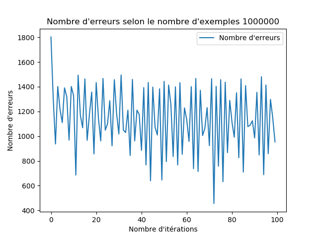

# SIMON HEBAN
## M1 WeDSci

### Installation

Vérifiez que python et matplotlib sont installés

    mkdir build
    cd build
    cmake ..
    ./TP4

### Question 3.1

Plus le nombre itération est grand plus le nombre d'erreurs est faible

### Question 3.2

On remarque que le nombre d'erreurs tends vers 0, toutefois une certaine liaison 
entre le nombre d'erreurs et le nombre d'exemples existe, c'est-à-dire que plus il y aura d'exemples, plus il y aura d'erreurs.

> Peu d'erreurs (10 exemples)

> beaucoup plus d'erreurs (1000000 exemples)

## Question 3.3

On remarque que si le nombre d'exemples est petit et que le pas d'apprentissage est petit aussi, alors le nombre d'erreurs est grand.

> On remarque ici que la courbe violette (plus petit pas d'apprentissage) provoque beaucoup d'erreurs.

Tandis que si l'on a un nombre d'exemples élevés (e.g 1 millions), et un pas d'apprentissage petit, on minimise alors le nombre d'erreurs.

> On remarque à contrario, que la courbe violette va minimiser le nombre d'erreurs