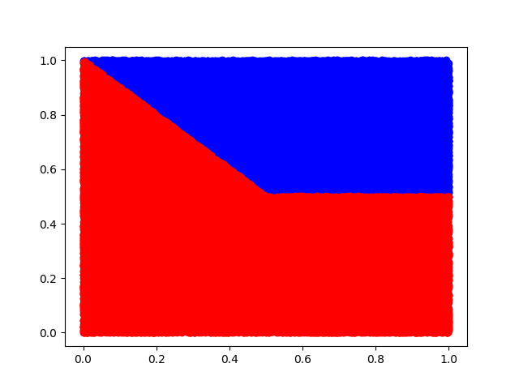

# SIMON HEBAN
## M1 WeDSci


### Installation

Vérifiez que python et matplotlib sont installés

    mkdir build
    cd build
    cmake ..
    ./TP4


### Question 3.1

Plus le nombre itération est grand plus le nombre d'erreurs est faible


### Question 3.2

On remarque sur ces deux graphes que plus un jeu de données et important, plus le nombre d'itérations avant de ne plus faire d'erreurs sera important


> Plus d'erreurs à partir de la 37ème itération


> Plus d'erreurs à partir de la 39ème itération

## Question 3.3

Le pas influe sur le nombre d'itérations nécessaire pour ne plus avoir d'erreurs, un pas d'apprentissage se rapprochant de un fera une descente plus radical, elle convient donc un petit nombre d'exemples.
Si on utilise un pas d'apprentissage petit, la descente est moins brutale, et on risque moins oublié des valeurs minimales.
C'est pour cela que l'on utilisera un pas de plus en plus petit au fur et à mesure que notre jeu de données grandit (e.g 5 millions)

On remarque que si le nombre d'exemples est petit et que le pas d'apprentissage est petit aussi, alors le nombre d'erreurs est grand.

> On remarque ici que la courbe violette (plus petit pas d'apprentissage) provoque beaucoup d'erreurs.


Tandis que si l'on a un nombre d'exemples élevés (e.g 1 millions), et un pas d'apprentissage petit, on minimise alors le nombre d'erreurs.

> On remarque à contrario, que la courbe violette va minimiser le nombre d'erreurs, elle va d'ailleurs ne plus faire d'erreurs à partir de la ~19 itérations


# PARTIE 3.4

On remplace la génération de données voir le fichier `lib/Helper.cpp`

```cpp
//res.emplace_back(std::make_pair(std::make_pair(x1,x2), ((x1+x2-1 > 0) ? 1 : -1)));
res.emplace_back(std::make_pair(std::make_pair(x1,x2), ((x1+x2-1 > 0 && x2 > 0.5) ? 1 : -1)));
```

Ce qui donne cette représentation :



On constate tout de suite que l'on ne pourra pas avoir des réponses exactes, en effet, le perceptron est un classifier linéaire, il nous sera imossible de bien séparer les rouges des bleues, on fera toujours des erreurs dans les grands jeux de données, en effet si on a un petit jeu de données il est possible que certains points rouges ne soit pas générer dans la zone non prédictible.


> On remarque ici un nombre bas d'erreurs dû à un petit jeu de données (50 exemples)


> Ici les erreurs sont très fréquentes, car impossible de prédire une partie des points rouges, car le jeu de données est trop grand, donc on se retrouve avec le schéma du dessus et il est donc impossible de tracer une droite de façon à séparer les deux groupes. 